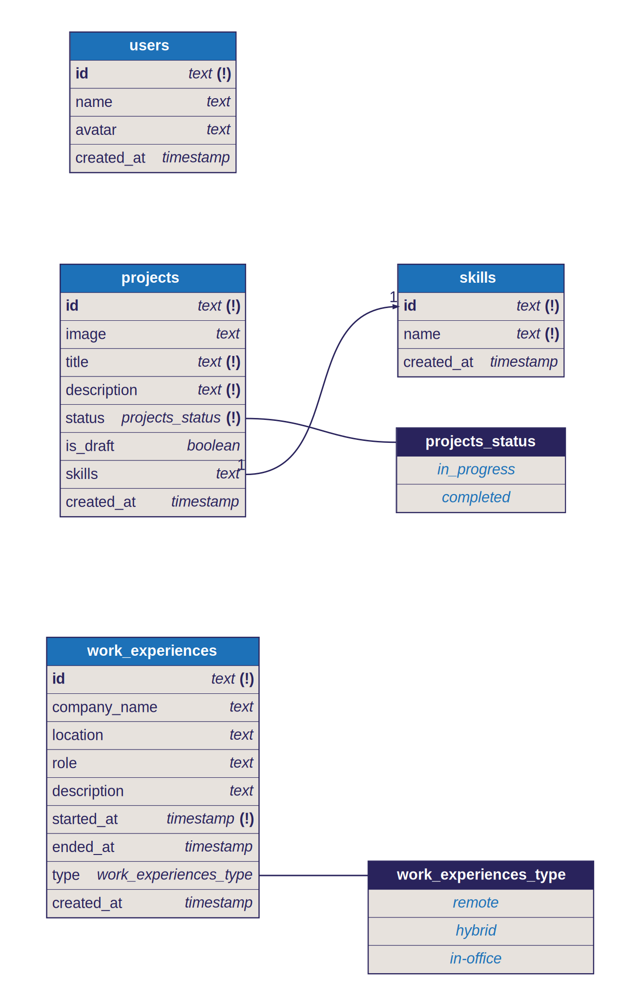

# PocketBase Templates

Welcome to the PocketBase Templates repository!  
This is a community-driven collection of templates tailored for PocketBase.

## Usage

1. Browse the templates in the repository.
2. Select a template that suits your project's needs and copy the contents.
3. Go to your PocketBase Admin settings go to "Import collections" under "Sync" and paste in the contents.

# Templates

Blog

Courses

Portfolio

## Contribution
We welcome contributions from the community! If you have a useful PocketBase template to share, please follow these steps:

1. Fork this repository.
2. Add your template with clear documentation.
3. Submit a pull request.

## Support

If you have any questions, encounter issues, or want to discuss ideas related to PocketBase Templates, feel free to open an issue or join our community discussions.

## License

This project is licensed under the [MIT License](LICENSE), so you're free to use, modify, and distribute these templates as needed.